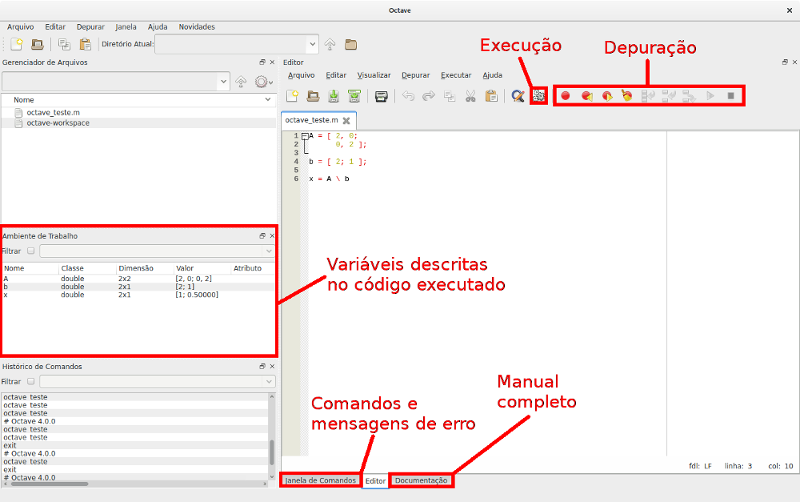

# elc1106
Redes de comunicação de dados

# Códigos de simulação para MATLAB/Octave

# Tutorial para instalação do Octave - créditos Vinicius Monego


# Descrição

[GNU Octave](https://www.gnu.org/software/octave/) é um [software livre](https://www.gnu.org/philosophy/free-sw.pt-br.html) para computação numérica, com sintaxe compatível com a do MATLAB®.

É dividido em um interpretador com funções básicas e vários pacotes que implementam funções de disciplinas mais específicas.

# Instalação

## Windows

[Link para download](https://ftp.gnu.org/gnu/octave/windows/) do instalador `octave-4.2.0-w64-installer.exe`, para uma plataforma Windows de 64 bits.

No Windows, todos os pacotes mais comuns já vêm pré instalados.

## GNU/Linux

No sistema GNU/Linux os pacotes do Octave são distribuídos separadamente e precisam ser instalados além do interpretador básico. Nos exemplos abaixo são instalados os pacotes `octave-control` (funções para sistemas de controle) e `octave-signal` (funções para processamento de sinais). `octave-info` é apenas o manual (não é um pacote do Octave). O download e instalação é feito usando os repositórios.

Em ambos os casos, o Octave aparecerá para uso no menu do desktop, ou pode ser invocado pela linha de comando como `$ octave`. A interface gráfica foi uma adição à versão 4.0.0. Para a versão 3.8 pode ser necessário usar o parâmetro force-gui: `$ octave --force-gui`

### Debian/Ubuntu

`$ sudo apt-get install octave octave-control octave-signal octave-info`

### Fedora

`# dnf install octave octave-control octave-signal`

# Utilização

A figura abaixo mostra o ambiente do Octave ressaltando as principais funcionalidades, e um exemplo de código executado. O código resolve o sistema linear `Ax = b`.



A principal diferença do Octave em relação ao MATLAB® é a modularidade. Para usar funções de um pacote é necessário carregar tal pacote explicitamente no código fonte pela instrução `pkg load`. Para carregar os dois pacotes instalados anteriormente deve ser acrescentado no topo do código

```octave
pkg load signal
pkg load control
```

# Recursos adicionais

[Apostila](https://edisciplinas.usp.br/pluginfile.php/256601/mod_resource/content/1/apostila_matlab_octave.pdf) (em português)

[Cheatsheet](https://altons.github.io/octave/2013/05/05/octave-commands-cheat-sheet/) (em inglês)
